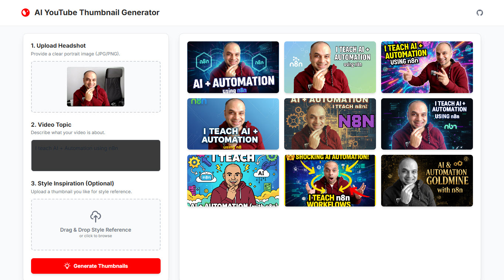
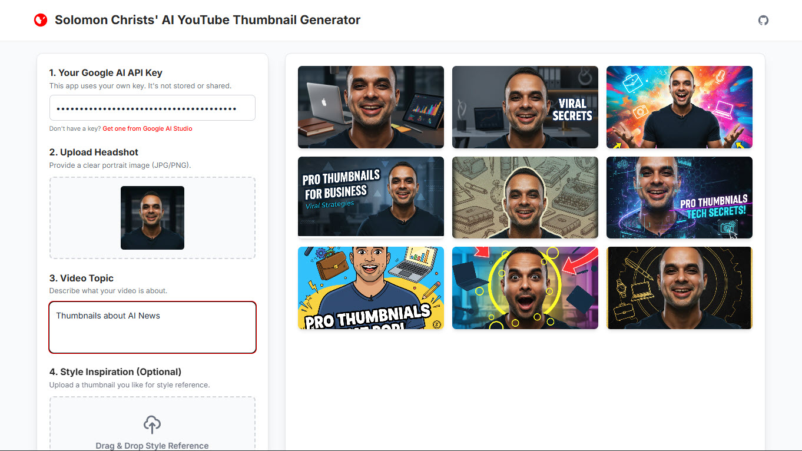
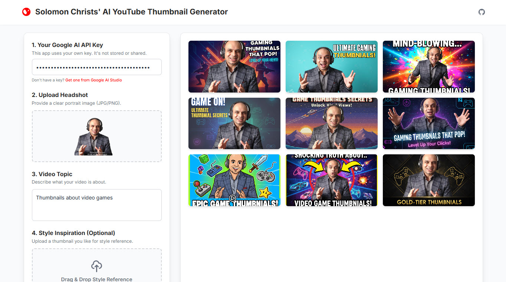

# AI YouTube Thumbnail Generator 🎨📺
> Generate Stunning YouTube Thumbnails Instantly with AI + Google Gemini

**AI YouTube Thumbnail Generator** is an open-source app that lets you create **9 professional YouTube thumbnails in seconds**. Simply upload your headshot, describe the style you want, and provide your **Google Gemini API key** — the app does the rest. Perfect for creators who want eye-catching thumbnails without the hassle of manual design.

**NOTE:** This was a Vibe Coded project by **Solomon Christ** and updates are the responsibility of community contributors.

---

## 📸 Demo & Screenshots

(Replace with actual image names once added to `images/`)

- 
- 
- 
- 
- 
- 

---

## 🎯 Vision
I created this app for **YouTube creators to save time and boost engagement** by generating high-quality thumbnails that grab attention. Just point, click, and get thumbnails that **increase CTR and grow your channel**.

---

## ❓ Why Was This Made?
Creators know thumbnails are one of the most important factors in YouTube success. However:
- Many lack the design skills to make professional thumbnails.
- Hiring designers can be costly and time-consuming.
- Existing tools are either expensive or generic.

**This app solves all three problems by:**
- Providing a **fast, AI-powered solution**.
- Allowing creators to **customize via natural language prompts**.
- Delivering **multiple options at once** (9 thumbnails per generation).

---

## ✨ Features
- 🖼️ **Upload Any Headshot**
  - Add yourself or any subject to make personalized thumbnails.

- ✍️ **Prompt-Based Customization**
  - Describe the style, mood, or theme (e.g., “bold text, red background, shocked face”).

- ⚡ **9 Variations at Once**
  - Save time by getting multiple thumbnail options instantly.

- 🔑 **Google Gemini API**
  - Uses your own API key for flexible usage and privacy.

---

## 🛠️ Tech Stack
- **AI Model:** Google Gemini  
- **Frontend:** Node.js, Single Page App (HTML, CSS, JavaScript)  
- **Backend:** None (client-side API calls)  
- **Deployment:** Works in browser or hosted as static app  

---

## 🚀 Quick Start

1. **Clone the repo:**
   ```bash
   git clone https://github.com/SolomonChrist/AI-YouTube-Thumbnail-Generator.git
   cd AI-YouTube-Thumbnail-Generator
   ```

2. **Open the app in your browser after setting up the Node.js system.**  

3. **Upload your headshot.**  

4. **Enter your Google Gemini API key.**  

5. **Type your thumbnail prompt.**  

6. **Generate!**  
   Within seconds, you’ll have **9 thumbnails ready to use.**

---

## 🤝 Contributing
This is an open-source project! You’re free to fork the repo, experiment, and adapt it. If you build something cool, I’d love to hear about it — let me know where and how you’re using it. It’s inspiring to see this tool being used to create amazing things.

---

## 📈 Upsell & Promotions
If you enjoy this project, check out my other work and join the community:

- 🎓 **Learn AI + Automation** → [Skool Community](https://www.skool.com/learn-automation/about)  
- 💼 **Hire Our Team (AI + Automation Consulting)** → [LinkedIn](https://www.linkedin.com/in/solomonchristai/)  
- 📺 **Tutorials & Demos** → [YouTube](https://www.youtube.com/@SolomonChristAI)  
- 🛠️ **More Open-Source Apps** → [GitHub](https://github.com/SolomonChrist)  
- 💰 **Affiliates / Partners** → Coming soon (tools, devices, learning resources)  

---

## 📫 Created By
Creator: **Solomon Christ**  

---

## ❤️ Support This Project

If you’d like to support continued development and community projects:
☕ Buy Me a Coffee → [ COMING SOON ]
💳 Donate via Stripe → [ COMING SOON ]

Your support keeps projects like this alive and helps build more open-source AI tools
---

## 📜 License
Licensed under the **MIT License** — see the [LICENSE](LICENSE) file for details.
